# kubevirt-crc-windows-tutorial
Running a Window Framework (NOT .NET Core) app on Kubernetes using CodeReady Containers and Kubevirt

This tutorial will guide you through the process of getting kubevirt running inside of OpenShift, and then using kubevirt to host a Windows VM in OpenShift. That Windows VM will be running an IIS-powered web site and a .NET Framework WCF service application.

## Glossary/Acronyms
CLI: Command-Line Interface  
CRC: CodeReady Containers  
VM: Virtual Machine  

## Prerequisites
CodeReady Containers  
`kubectl` CLI  
`oc` CLI  
`virtctl` CLI  
`cdi` CLI  

## Prepare CRC
The default VM that is created by CRC is too small at 30GB. It must be resized to just over 100GB in order for this tutorial to work.

The steps are:
1. Create a VM
2. Stop CRC
3. Resize the VM
4. Start CRC and continue with the tutorial.

### Set VM memory
Make sure the VM has enough RAM in order to keep performance acceptable. More is better in this case. We'll set aside about 12GB of RAM.

`crc config set memory 12000`

### Start in order to be a VM

`crc start`

### Stop
After CRC has started, there is no reason (yet) to sign in. Immediately stop CRC (and the VM in the procss) so the VM can be resized.

`crc stop`

### Resize the VM
Now, add 75GB to the VM by running the makebig script:  

`./makebig.sh`

### Start
Now we can start CRC and proceed with the tutorial.  

`crc start`  

That will supply you with the proper login information. 

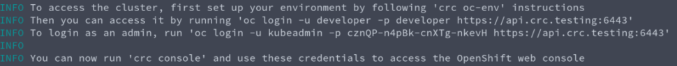

Log in and set your operating environment.

## Login...
 
`oc login -u kubeadmin -p your_password_goes_here https://api.crc.testing:6443`  

For example, `oc login -u kubeadmin -p cznQP-n4pBk-cnXTg-nkevH https://api.crc.testing:6443`  

## ...set the oc command environment...
`eval (crc oc-env)`  

## ...and create your new project

`oc new-project virtwin`

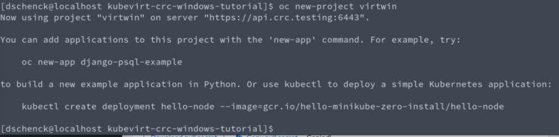 

## Install kubevirt Operator  
This first part will get the current version number (e.g. 0.25.0) into an environment variable.  

&nbsp;bash&nbsp;

`export KUBEVIRT_VERSION=$(curl -s https://api.github.com/repos/kubevirt/kubevirt/releases/latest | jq -r .tag_name)`     

`kubectl create -f https://github.com/kubevirt/kubevirt/releases/download/${KUBEVIRT_VERSION}/kubevirt-operator.yaml`

&nbsp;PowerShell&nbsp;

`$env:KUBEVIRT_VERSION = (ConvertFrom-Json (curl https://api.github.com/repos/kubevirt/kubevirt/releases/latest).content)[0].tag_name`  

`kubectl create -f https://github.com/kubevirt/kubevirt/releases/download/$env:KUBEVIRT_VERSION/kubevirt-operator.yaml`

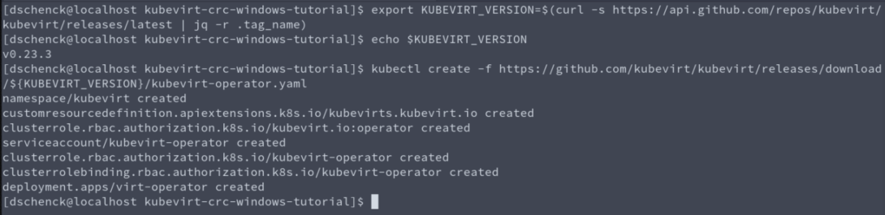

## Create instance of kubevirt Operator  
With the kubevirt Operator installed, we next need to invoke an instance of kubevirt. After this command is run, seven pods will be created and running in the namespace "kubevirt". At that point, kubevirt is up and running.  

&nbsp;bash&nbsp;
  

`kubectl create -f https://github.com/kubevirt/kubevirt/releases/download/${KUBEVIRT_VERSION}/kubevirt-cr.yaml`  

&nbsp;PowerShell&nbsp;
  

 `kubectl create -f https://github.com/kubevirt/kubevirt/releases/download/$env:KUBEVIRT_VERSION/kubevirt-cr.yaml`

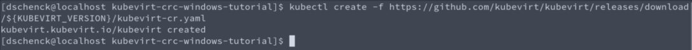

## Install CDI
The [Containerized Data Importer](https://github.com/kubevirt/containerized-data-importer), or CDI, must be installed in our kubernetes (OpenShift) cluster in order to upload the Windows VM.  

The first step captures the CDI's version number in an environment variable to be used in the two later steps.

&nbsp;bash&nbsp;
  

`export CDI_VERSION=$(curl -s https://github.com/kubevirt/containerized-data-importer/releases/latest | grep -o "v[0-9]\.[0-9]*\.[0-9]*")`  

`kubectl create -f https://github.com/kubevirt/containerized-data-importer/releases/download/$CDI_VERSION/cdi-operator.yaml`  

`kubectl create -f https://github.com/kubevirt/containerized-data-importer/releases/download/$CDI_VERSION/cdi-cr.yaml`

&nbsp;PowerShell&nbsp;
  
 
`$env:CDI_VERSION = (curl https://github.com/kubevirt/containerized-data-importer/releases/latest | Select-String "v[0-9]\.[0-9]*\.[0-9]*").matches | select -exp value`

`kubectl create -f https://github.com/kubevirt/containerized-data-importer/releases/download/$env:CDI_VERSION/cdi-operator.yaml`

`kubectl create -f https://github.com/kubevirt/containerized-data-importer/releases/download/$env:CDI_VERSION/cdi-cr.yaml`

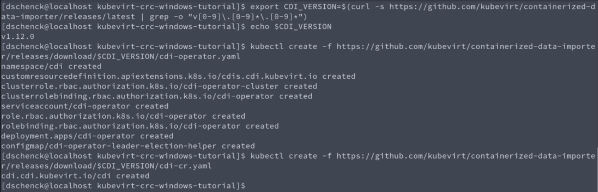

## Upload VM image

`virtctl image-upload dv windows --size=50Gi --image-path=Summit2019.raw --insecure`

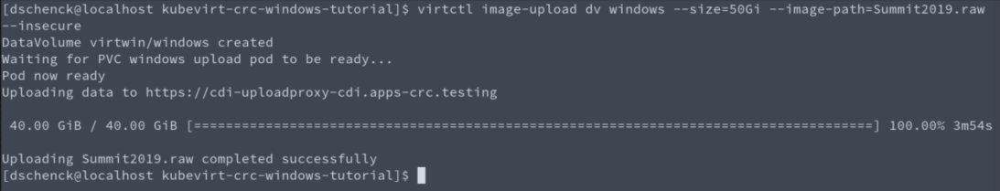

## Create VM

`oc apply -f vm-windows.yml`

## Tweak file permissions
Here's where things get a bit tricky. Kubevirt was originally intended to run on a bare metal kubernetes installation, and we're using CodeReady Containers -- a VM running kubernetes (and OpenShift). In addition, we'll be using CRC's supplied Persistent Volumes (PV) for our storage. Those PVs don't have the correct permissions for our kubevirt instance, so we need to change the top-level directory's permissions.

The error, which appears in the "Events" tab when you view the virtual machine in the OpenShift dashboard, is the following:

"(.../var/run/kubevirt-private/vmi-disks/pvcvolume/disk.img': Permission denied')"

The workaround is to run a command inside the pod that control the virtual machine, a command that will grant access to the VM.  

First, get the pod identifier:

#### IF YOU HAVE AWK INSTALLED ON YOUR PC:  
`export VM_POD_ID=$(oc get pods | sed -n 2p | awk '{print $1}')`
`oc exec $VM_POD_ID chmod 777 /var/run/kubevirt-private/vmi-disks/pvcvolume`

#### If you DO NOT have AWK installed on your PC:

`oc get pods`

It will follow the pattern of "virt-windows-app-server-______".

Then, use the pod id in the following command:

`oc exec {POD_ID_GOES_HERE} chmod 777 /var/run/kubevirt-private/vmi-disks/pvcvolume`

After running this command, in order to speed things up, you may want to restart the VM.

## Start the cluster dashboard/console

In another terminal session on the host, launch the OpenShift console in your default browser by running the following command: 

`crc console`  

Log in as user "kubedamin", using the same password that you used to log in at the comand line, earlier.  

Using the console, you can watch the Windows VM start.

Under the "Workloads" section of the menu, select the "Virtual Machines" option. Make sure you are in the project "virtwin", and you can see the VM entitled "windows-app-server" listed.

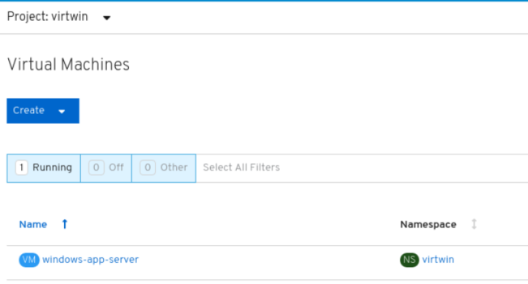

Click on the VM name (windows-app-server) in order to view the details for the VM. Once there, use the "Consoles" tab to see the VM start.

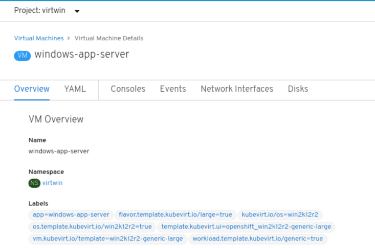

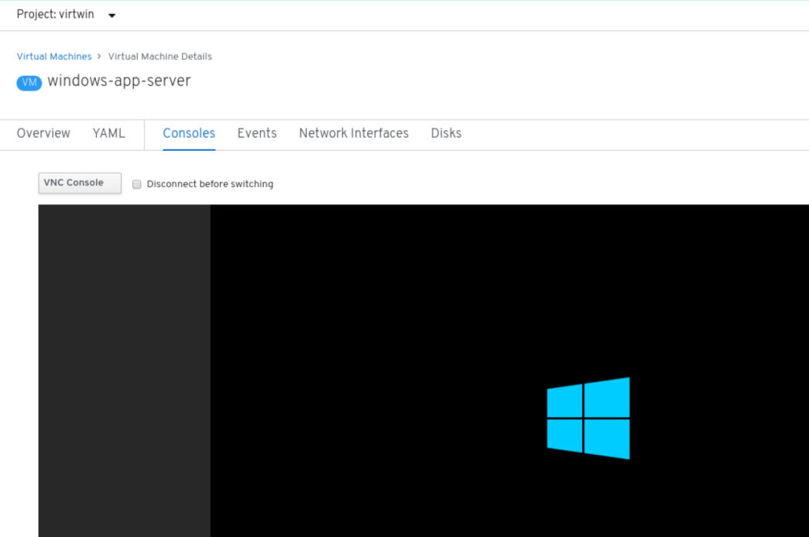

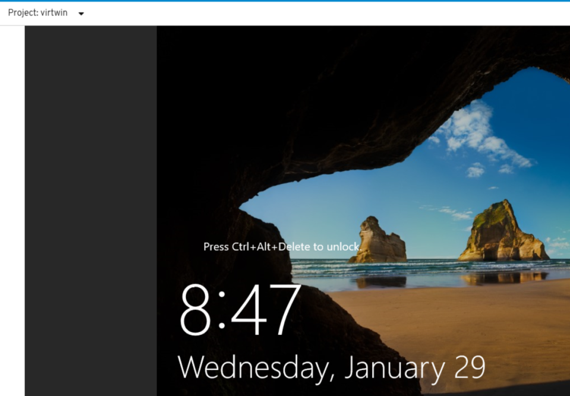

After the VM has started, you can see that no RDP is available.

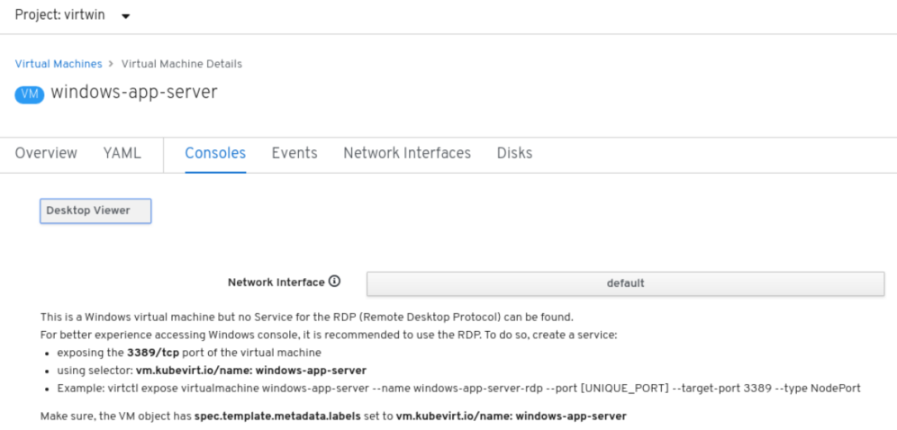

## Create Remote Desktop Protocol (RDP) service

`virtctl expose virtualmachine windows-app-server --name windows-app-server-rdp --port 3389 --target-port 3389 --type NodePort`

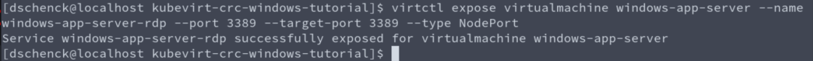

After running the command, you can return to the dashboard and see that the RDP function is now available.

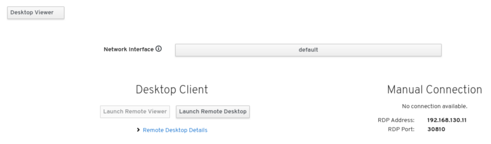

## Log in using RDP

Use the Remote Desktop option and sign in to the Windows VM. Note: the password is `Pa$$word`

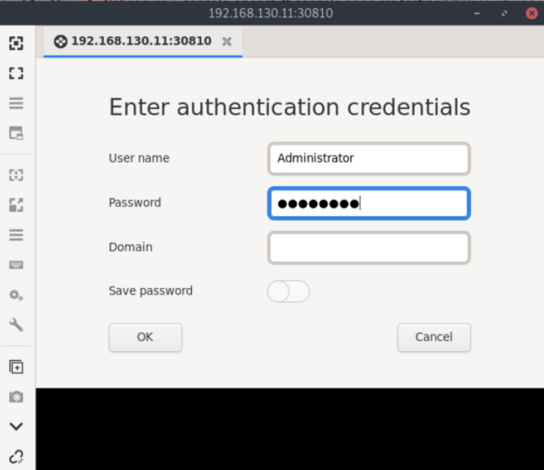

### IMPORTANT  
Note that there appears to be some defect with respect to the RDP function. If you disconnect or log out from the Windows VM, you will need to restart the VM in order to use RDP again.

## Create web Service

`virtctl expose virtualmachine windows-app-server --name windows-app-server-web --port 80 --target-port 80 --protocol="TCP"`

## Create Routes

`oc expose service windows-app-server-web`

## View web site

Inside the web dashboard, open the "Networking" section and select the "Routes" option. You will see the route to the web site. Clock on the URL to open the Wingtip Toys web site in your browser.

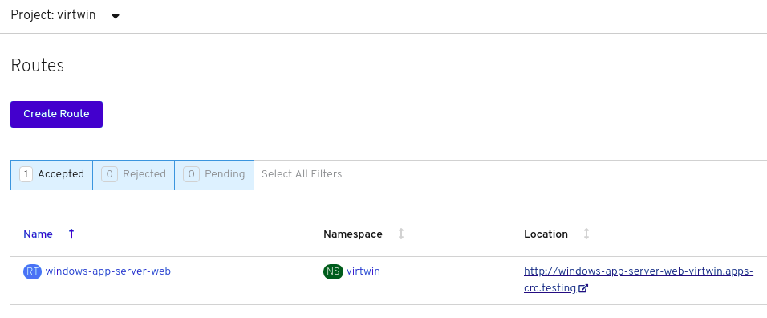

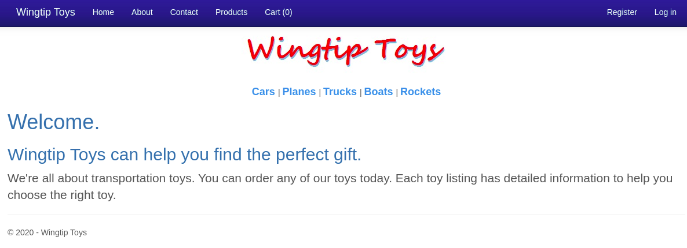

## Congratulations

You now have a .NET Frameworks web site, and an instance of MS SQL Server, running on a VM in kubernetes.